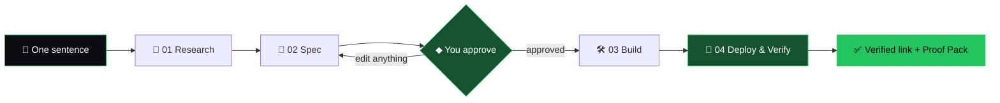
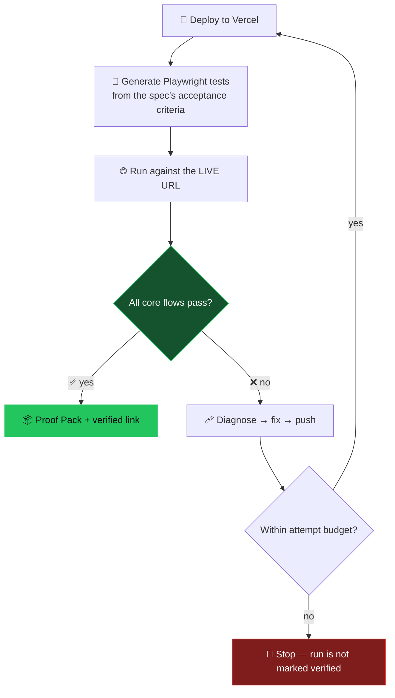
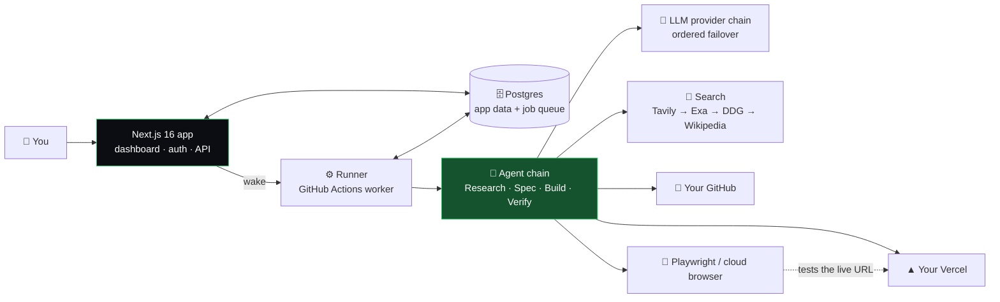

<div align="center">


<a href="https://lastmileqa.vercel.app/">
  
</a>

<br/>

[](https://lastmileqa.vercel.app/)
[](https://lastmileqa.vercel.app/#waitlist)
[](https://github.com/AYTechOfficial/lastmile/commits/main/)


**[🌐 Live site](https://lastmileqa.vercel.app/)** &nbsp;·&nbsp; **[⚡ How it works](#-how-it-works)** &nbsp;·&nbsp; **[🧾 Proof Pack](#-every-run-ships-with-receipts)** &nbsp;·&nbsp; **[🚀 Run it locally](#-getting-started)** &nbsp;·&nbsp; **[❓ FAQ](#-faq)**

</div>

<br/>

## 🧭 Table of Contents

- [The Problem](#-the-problem)
- [What is LastMile?](#-what-is-lastmile)
- [How It Works](#-how-it-works)
- [The Verify Loop](#-the-verify-loop-the-whole-point)
- [Every Run Ships With Receipts](#-every-run-ships-with-receipts)
- [How It Compares](#-how-it-compares)
- [Features](#-features)
- [Architecture](#-architecture)
- [Tech Stack](#-tech-stack)
- [Project Structure](#-project-structure)
- [Getting Started](#-getting-started)
- [Configuration](#-configuration)
- [Scripts](#-scripts)
- [FAQ](#-faq)
- [Contributing](#-contributing)
- [Credits](#-credits)

<br/>

## 💔 The Problem

> **Good ideas don't die at ideation. They die at execution.**

A whole generation of builders can finally ship. What they get back, almost every time, is a *first version* — not a *product*.

| 🧱 One-shot builders stop at "code generated" | 🌙 Deploys break silently | 👀 Nobody checks the live app |
| :--- | :--- | :--- |
| Prompt straight to code, with no research shaping the spec — so v1 regularly ships missing what a comparable production app already has. | Picking a stack. Wiring auth and a database. Fighting a deployment that fails for reasons nobody warned you about — alone, at 1am. | Freelancers, no-code, one-shot builders, even autonomous agents: none re-check the live URL after deploying and fix it themselves. |

```text
 prompt  ──▶  code  ──▶  ???  ──▶  you
                          ▲
                   your evenings live here
```

<br/>

## ✨ What is LastMile?

**LastMile is a chained multi-agent pipeline** that takes a single sentence and hands you back a **live product that has already passed its own exam.**

It researches your market, writes the spec, builds the codebase, ships it to a live URL — **then tests the real deployed app against its core flows and fixes what breaks.**

```bash
$ lastmile run "a crm for freelance photographers"

→ research     14 sources · 6 comparable products
→ spec         4 core flows · 12 acceptance criteria
◆ approve      spec approved by you · 2 min
→ build        next.js · pushed to your github
→ deploy       live on your vercel
→ verify       4/4 flows passing · 1 auto-fix · 0 console errors

✔ https://photographer-crm.vercel.app   ← a link that already survived its own exam
```

<div align="center">

| 🤖 **4** agents | 🙋 **1** human checkpoint | 🔗 **0** broken links shipped |
| :---: | :---: | :---: |

<sub>The last mile — checking the live app and fixing it — finally belongs to the pipeline, not to you.</sub>

</div>

<br/>

## ⚡ How It Works



Every stage hands its output to the next — and **nothing reaches you until the last stage says the live product actually works.**

<table>
<tr>
<td width="60" align="center"><h3>01</h3></td>
<td>

### 🔎 Research — *real products, real stacks*
The Research Agent reads your sentence and **searches live** for comparable products — their current features, pricing, tech stacks — plus the tools it actually takes to ship one to production. **The build starts from evidence, not a guess.**

`live web search` · `competitive matrix` · `production checklist`

</td>
</tr>
<tr>
<td align="center"><h3>02</h3></td>
<td>

### 📝 Spec — *the PRD, written properly*
The Spec Agent turns that research into a senior-engineer-quality build prompt: **user stories, data model, screens, API surface** — and **acceptance criteria for every core flow**, which later become the verification tests.

`user stories` · `data model` · `acceptance criteria`

</td>
</tr>
<tr>
<td align="center"><h3>◆</h3></td>
<td>

### 🙋 You approve — *a two-minute look before anything is built*
The spec lands in your dashboard. Edit anything, approve when it's right — so **no build time is ever wasted on a misread one-liner.** The only human step in the whole pipeline.

`human checkpoint` · `edit anything` · `2-minute review`

</td>
</tr>
<tr>
<td align="center"><h3>03</h3></td>
<td>

### 🛠️ Build — *the codebase, end to end*
The Core Build Agent writes the full app on a curated **Next.js + Tailwind** production scaffold, then **proves it locally** — install, typecheck, build, smoke test — before pushing everything to **your connected GitHub**. It's your code. **No lock-in.**

`your github` · `internal smoke tests` · `no lock-in`

</td>
</tr>
<tr>
<td align="center"><h3>04</h3></td>
<td>

### 🚀 Deploy & Verify — *tests the live app, then fixes it*
Deploys to **your connected Vercel**, generates **Playwright tests from the spec's acceptance criteria**, and runs them against the **live URL**. On failure it loops: **diagnose → fix → redeploy → re-test**, inside an attempt budget.

`playwright vs live url` · `loops until it passes` · `attempt budget`

</td>
</tr>
<tr>
<td align="center"><h3>✓</h3></td>
<td>

### ✅ Output — *a working link, already checked*
Handed over with the **Proof Pack**: what was tested, what failed, what got fixed, what passed. You click a link that has already survived its own exam.

`verified link` · `proof pack attached`

</td>
</tr>
</table>

<br/>

## 🔁 The Verify Loop (the whole point)

Stage 04 is the step no other route on the market performs. It's not a bolt-on — **it's the product.**



<br/>

## 🧾 Every Run Ships With Receipts

Not a promise — **a report.** Each core flow from your spec becomes a Playwright test against the deployed URL. What was tested, what failed, what got fixed, what passed — with **screenshots, console and network logs, and a trace attached.**

<details open>
<summary><b>📦 Sample Proof Pack — run #0042 · "CRM for freelance photographers"</b></summary>

<br/>

| # | Core flow | Assertions | Browser | Time | Result |
| :-: | :--- | :-: | :-: | :-: | :-: |
| 1 | Signup → login → dashboard | 4 | Chromium | 1.9s | ✅ pass |
| 2 | Create project · persists on reload | 6 | Chromium | 2.4s | ✅ pass |
| 3 | Invite teammate by email | 5 | Chromium | 2m 14s | 🩹 **fixed · attempt 2** |
| 4 | Payment stub renders in checkout | 3 | Chromium | 0.8s | ✅ pass |

| 🧪 Flows | 🚀 Deploys | 🩹 Auto-fixes | 🧯 Console errors | 🌐 Network 4xx/5xx | 🪙 Tokens | 💵 Cost |
| :-: | :-: | :-: | :-: | :-: | :-: | :-: |
| **4 / 4** | 2 | 1 | **0** | **0** | 412k | $1.87 |

📎 12 screenshots · 1 trace · console & network logs · visual check (VLM) on every flow

<sub>Figures above are the sample run showcased on the <a href="https://lastmileqa.vercel.app/">landing page</a> — the product shown is what you get, not a promise of it.</sub>

</details>

<br/>

## 🥊 How It Compares

Every route to a working product. **One closes the loop.**

| Route to a working product | Fast first version | Output you can ship | Researches the market up front | Re-checks the live URL, then fixes it |
| :--- | :-: | :--- | :--- | :-: |
| 👷 **Freelance developers** | 🐢 slow | accurate, but expensive | not addressed | manual — and you pay for it |
| 🧩 **No-code tools** *(Bubble, Webflow)* | ⚡ fast | limited and locked-in | not addressed | ❌ |
| 🤖 **One-shot AI app-builders** *(bolt.new, Lovable, Replit Agent)* | ⚡ fast | ships missing features, needs cleanup | reactive only | ❌ |
| 🦾 **Autonomous coding agents** *(Devin)* | not addressed | roughly 1 task in 4 needs a human | needs a scoped ticket + existing codebase | ❌ |
| 🟢 **LastMile** | ⚡ one sentence in | ✅ **verified before handover** | ✅ **stage 01, before any code** | ✅ **stage 04 — loops until it passes** |

<sub>Comparison reflects the positioning on the project's landing page.</sub>

<br/>

## 🎯 Features

<table>
<tr>
<td width="50%" valign="top">

#### 🔎 Evidence-first research
Live search walks **Tavily → Exa → DuckDuckGo → Wikipedia** and uses the first that answers — so search works even with **zero keys configured**.

#### 📝 Spec you can actually edit
A real PRD with acceptance criteria — reviewed and approved by **you** before a single line is generated.

#### 🛠️ Your code, your repo
Everything is pushed to **your GitHub**. Fork it, rewrite it, walk away. **No lock-in.**

</td>
<td width="50%" valign="top">

#### 🚀 Your infra, your deploy
Ships to **your connected Vercel**. Platform-level fallback credentials cover users who haven't linked their own.

#### 🧪 Live-URL verification
Playwright tests are **generated from the spec** and run against the **deployed** app — not a localhost mock.

#### 🩹 Self-healing deploys
Fail → diagnose → fix → redeploy → re-test, inside an **attempt budget**.

</td>
</tr>
<tr>
<td valign="top">

#### 🧠 Resilient model chain
Every provider speaks the OpenAI chat-completions dialect, so **one client covers them all** — with **ordered failover** (`AI_PROVIDER_ORDER`) so one flaky provider never kills a run.

#### 🗄️ Postgres-backed job queue
Work is queued in Postgres with **leases**, picked up by a worker, and woken on demand — durable and inspectable.

</td>
<td valign="top">

#### 🖥️ Live run dashboard
Watch every stage — research, spec, approval, build, verify — with per-run **cost, tokens and timings**.

#### 🌐 Free vs Pro verification
Pro runs can drive a **cloud browser** with an embedded live session; free runs verify in an **embedded local browser**. Same stage, same deployed URL — only the driver changes.

</td>
</tr>
</table>

<br/>

## 🏗️ Architecture



The web app **queues work and then wakes a runner**. A shared-secret "doorbell" endpoint lets the database's cron job reclaim stale leases and wake a runner — nothing else.

<br/>

## 🧰 Tech Stack

| Layer | Tools |
| :--- | :--- |
| **Framework** | Next.js 16 · React 19 · TypeScript 5 |
| **Styling & motion** | Tailwind CSS 4 · Motion · Lenis smooth scroll · Lucide icons |
| **Typography** | Inter · Space Grotesk · JetBrains Mono · Instrument Serif |
| **Database** | PostgreSQL (Supabase pooler) · Drizzle ORM · drizzle-kit migrations |
| **Auth** | Auth.js v5 (`next-auth`) · Drizzle adapter · GitHub OAuth · bcrypt credentials |
| **Secrets** | libsodium (encrypted CI secrets) |
| **AI** | OpenAI-compatible provider chain with ordered failover |
| **Search** | Tavily · Exa · DuckDuckGo · Wikipedia |
| **Verification** | Playwright (Chromium) · optional Browser Use cloud browser |
| **Infra** | Vercel · GitHub Actions runner |

<br/>

## 🗂️ Project Structure

```text
lastmile/
├── 📁 app/             # Next.js App Router — pages, layouts, API routes
├── 📁 components/      # UI building blocks
├── 📁 lib/             # Core logic — agents, providers, queue, integrations
├── 📁 runner/          # Worker that executes pipeline jobs
├── 📁 drizzle/         # SQL migrations & schema snapshots
├── 📁 scripts/         # DB tooling + pipeline / queue / credential verifiers
├── 📁 public/          # Static assets
├── 📁 .github/workflows/   # CI + the runner workflow (woken by the app)
├── 📄 .env.example     # Every environment variable, documented
├── 📄 drizzle.config.ts
├── 📄 next.config.ts
└── 📄 package.json
```

<br/>

## 🚀 Getting Started

### Prerequisites

- **Node.js** 20+
- A **Postgres** database (Supabase pooler works great)
- A **GitHub** token and a **Vercel** token (platform defaults for users who haven't linked their own)
- At least **one LLM provider key** to make the pipeline go live

### 1 · Clone & install

```bash
git clone https://github.com/AYTechOfficial/lastmile.git
cd lastmile
npm install
```

### 2 · Configure

```bash
cp .env.example .env.local
npx auth secret      # generates AUTH_SECRET
```

Fill in `DATABASE_URL`, `AUTH_SECRET`, `GITHUB_TOKEN`, `VERCEL_TOKEN` and at least one model key. See [Configuration](#-configuration).

### 3 · Set up the database

```bash
npm run db:migrate   # apply migrations
npm run db:seed      # (optional) seed starter data
```

### 4 · Run it

```bash
npm run dev          # → http://localhost:3000
```

### 5 · Sanity-check the machinery

```bash
npm run verify:credentials   # are your tokens & keys valid?
npm run verify:queue         # does the Postgres job queue work?
npm run verify:wake          # does the runner wake-up path work?
npm run verify:pipeline      # end-to-end pipeline check
```

> 💡 **No search keys? No problem.** The Research Agent falls back to keyless DuckDuckGo and Wikipedia, so search works out of the box.

<br/>

## ⚙️ Configuration

All variables live in [`.env.example`](./.env.example). The essentials:

<details open>
<summary><b>🔴 Required</b></summary>

| Variable | What it does |
| :--- | :--- |
| `DATABASE_URL` | Postgres connection (Supabase session/transaction pooler). The app **and** the worker connect here; the queue lives in this database. |
| `AUTH_SECRET` | Auth.js secret — generate with `npx auth secret`. |

</details>

<details>
<summary><b>🟡 Platform credentials</b> — defaults every user falls back to</summary>

| Variable | What it does |
| :--- | :--- |
| `GITHUB_TOKEN` | Creates a repo per project when the user hasn't linked their own GitHub. Classic PAT with `repo`, or fine-grained with *Administration: write*. |
| `VERCEL_TOKEN` · `VERCEL_TEAM_ID` | Deploys generated projects when the user hasn't connected their own Vercel. |
| `ADMIN_EMAILS` | Comma-separated operator accounts allowed into `/admin`. |
| `AUTH_GITHUB_ID` · `AUTH_GITHUB_SECRET` | GitHub OAuth sign-in. |
| `NEXT_PUBLIC_SIGNUP_MODE` | `waitlist` or `open`. |

</details>

<details>
<summary><b>🧠 Models</b> — add any one to make the pipeline live</summary>

All providers speak the OpenAI chat-completions dialect, so one client covers them and the chain **fails over in order**.

| Variable | Provider |
| :--- | :--- |
| `GROQ_API_KEY` · `GROQ_MODEL` | Groq |
| `GEMINI_API_KEY` · `GEMINI_MODEL` | Google Gemini |
| `CEREBRAS_API_KEY` · `CEREBRAS_MODEL` | Cerebras |
| `OPENROUTER_API_KEY` · `OPENROUTER_MODEL` | OpenRouter |
| `NVIDIA_API_KEY` · `NVIDIA_MODEL` | NVIDIA |
| `TRUEMODEL_API_KEY` · `HCNSEC_API_KEY` · `AION_API_KEY` | Additional catalogs |
| `AI_PROVIDER_ORDER` | Override failover order, e.g. `groq,gemini,openrouter` |

</details>

<details>
<summary><b>🔎 Search · 🧪 Live QA · ⚙️ Worker</b></summary>

| Variable | What it does |
| :--- | :--- |
| `TAVILY_API_KEY` · `EXA_API_KEY` | Optional premium search. Without them, keyless DuckDuckGo → Wikipedia is used. |
| `BROWSER_USE_API_KEY` · `BROWSER_USE_BASE_URL` | **Pro** cloud browser for live QA. Without it, runs verify in an embedded local browser. |
| `WORKER_ID` · `WORKER_CONCURRENCY` | Identifies the worker in job leases · jobs one worker may run at once. |
| `RUNNER_REPO` · `RUNNER_REF` · `RUNNER_WORKFLOW` · `RUNNER_TOKEN` | Which repo/branch/workflow to dispatch to wake a runner. Without `RUNNER_REPO`, queued work waits for a sweep instead of starting instantly. |
| `WAKE_SECRET` | Shared secret between the DB cron job and `/api/runner/wake`. A doorbell, not a key. |

</details>

<br/>

## 📜 Scripts

| Command | What it does |
| :--- | :--- |
| `npm run dev` | Start the dev server on port 3000 |
| `npm run build` · `npm start` | Production build · serve it |
| `npm run lint` · `npm run typecheck` | ESLint · `tsc --noEmit` |
| `npm run db:generate` | Generate a Drizzle migration from schema changes |
| `npm run db:migrate` | Apply migrations |
| `npm run db:seed` | Seed the database |
| `npm run db:inspect` | Peek inside the database |
| `npm run run:inspect` | Inspect a pipeline run |
| `npm run ci:secrets` | Push CI secrets to the runner repo |
| `npm run verify:queue` · `verify:credentials` · `verify:pipeline` · `verify:wake` | Health checks for each moving part |

<br/>

## ❓ FAQ

<details>
<summary><b>Is this just another prompt-to-app builder?</b></summary>

No. Builders stop at code — that's the whole problem. LastMile starts with live research, gets your approval on a real spec, and doesn't call itself done until the **deployed app has passed its core flows on the live URL.**

</details>

<details>
<summary><b>What does "verified" actually mean?</b></summary>

Each core flow in your approved spec becomes a Playwright test that runs against the **deployed URL**. "Verified" means those flows passed — and the Proof Pack shows what was tested, what failed, what was fixed, and what passed, with screenshots, logs and a trace.

</details>

<details>
<summary><b>Is the code mine? Is there lock-in?</b></summary>

It's yours. The full codebase is pushed to **your connected GitHub** and deployed to **your Vercel** — on a plain Next.js + Tailwind scaffold. No lock-in.

</details>

<details>
<summary><b>Who is it for?</b></summary>

Builders with a good idea and no appetite for the execution grind — solo founders, students, designers, and anyone tired of a "first version" that still needs their evenings.

</details>

<details>
<summary><b>When can I use it?</b></summary>

The pipeline is being finished in the open. **[Join the waitlist](https://lastmileqa.vercel.app/#waitlist)** — one email, when links are ready.

</details>

<br/>

## 🤝 Contributing

Ideas, bug reports and pull requests are welcome.

1. 🍴 Fork the repo
2. 🌿 Create a branch — `git checkout -b feat/your-idea`
3. ✅ Make sure `npm run lint` and `npm run typecheck` pass
4. 📬 Open a pull request describing what changed and why

Found something broken? [Open an issue](https://github.com/AYTechOfficial/lastmile/issues) — fittingly, we like things that get checked.

<br/>

## 🙌 Credits

<div align="center">

A **"Zero to Idea"** build by **Amitesh Yadav** · Samsara World Academy

[](https://github.com/AYTechOfficial)
[](https://lastmileqa.vercel.app/)

<br/>

**⭐ If a link that's already been tested sounds like the future, star the repo.**


<sub>The last mile, closed. &nbsp;·&nbsp; Research → spec → your approval → build → deploy &amp; verify.</sub>

</div>
